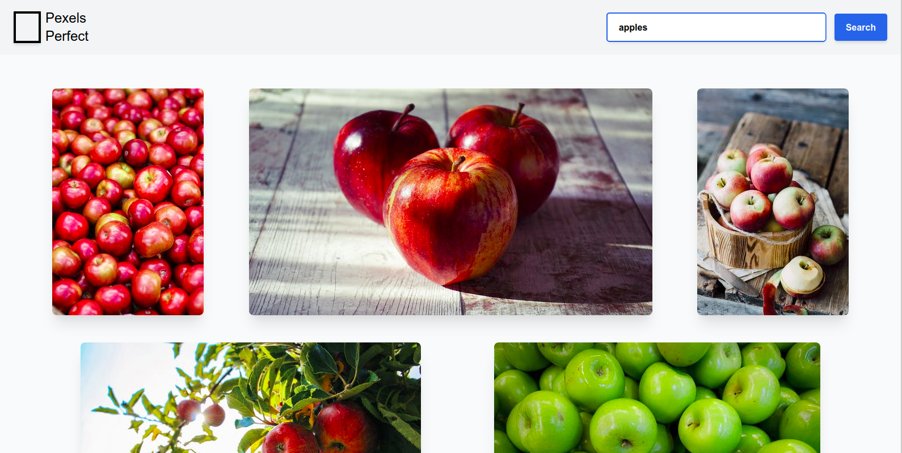

<div align="center">

#  **Pexels Perfect**

### WebApp Link: https://pexelsperfect.netlify.app/
## Photo Gallery build using ReactJS and Pexels API.
### Implemented debouncing and throttling to reduce the API calls

</div>

<br />

## Tech Stack

<code></code>
&nbsp;
<code></code>
&nbsp;
<code></code>

## Build Setup

```bash
# install dependencies
yarn install

# runs the app in the development mode.
yarn start

# builds the app for production to the build folder.
yarn build
```

## Stopwatch WebApp Screenshots

<div>



</div>

## Deploys

[](https://app.netlify.com/sites/stupefied-goldstine-0d23f1/deploys)

## Contributing

Feel free to dive in! [Open an issue](https://github.com/iampavangandhi/PexelsPerfect/issues/new) or submit PRs.

## License

[MIT](LICENSE) © Pavan Gandhi
